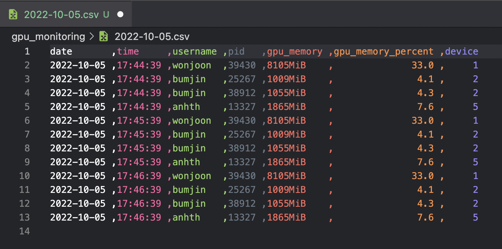
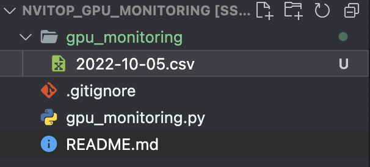

# nvitop_gpu_monitoring

Scripts for [nvitop](https://github.com/XuehaiPan/nvitop) gpu monitoring. 

* Saving **user** specific gpu usages
* Saving date are automatically changed 

### [DEMO]

--- 
### [Generated CSVs]

The script generates directory to save the csv files which are changed when the day is over. 

---- 
### [Analysis]

Given the csv files, we provide some analysis tools (TBD)
